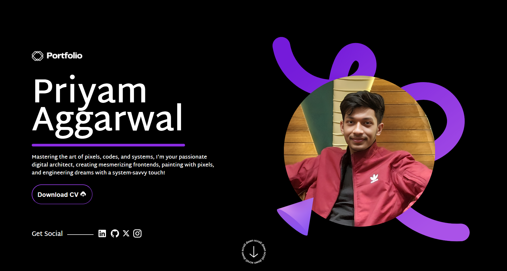

# :page_with_curl: Portfolio Website :dart:

#### Welcome to my Portfolio Website ! This is a live, fully interactive showcase of my work, skills, and projects. Designed with a focus on clean, user-friendly UI/UX, the website highlights my expertise in creating engaging and dynamic digital experiences. My portfolio is a true visual delight, featuring a sleek and modern design that has been meticulously curated with a keen eye for detail. The strategic use of color, typography, and layout creates a harmonious visual experience that is both engaging and aesthetically pleasing. The animations sprinkled throughout add a touch of dynamism and interactivity, ensuring that your journey through my portfolio is as captivating as it is informative.

# :hammer_and_wrench: Built With

#### This project was built using these technologies.
<ul>
 <li><b>  HTML5, CSS3, JavaScript:</b> The foundation of the website with modern web technologies to ensure compatibility and performance across browsers.</li>
 <li><b>  Animations:</b> Utilized CSS animations and JavaScript for smooth transitions and interactive elements.</li>
 <li><b>  Design Principles:</b> Applied UI/UX best practices for layout, color theory, and typography, ensuring a harmonious visual design and intuitive user navigation.</li>
</ul>

#  :bulb: Key Features
<ul>
  <li><b>Interactive UI/UX Design:</b> A smooth and intuitive user interface that offers a seamless experience for visitors. Every interaction is thoughtfully designed to enhance usability and engagement.</li>

<li><b>Strategic Use of Color, Typography, and Layout:</b> The design incorporates a cohesive color palette, modern typography, and well-planned layouts to create a visually appealing and professional aesthetic.</li>

<li><b>Dynamic Animations:</b> Subtle and meaningful animations are integrated throughout the site, making the experience lively and dynamic while guiding users' attention to key sections.</li>
</ul>

# Click Here : <a href="https://priyamaggarwal18.github.io/Portfolio/" target="_blank" style="background-color: purple; color: white; padding: 10px 20px; border-radius: 5px; text-decoration: none;">Visit my Portfolio</a>

